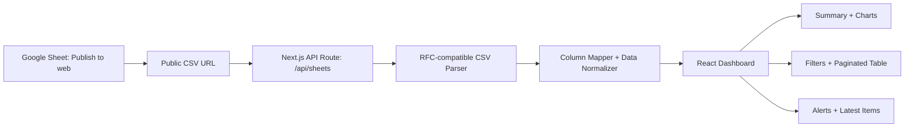

# System Architecture

## Overview

The dashboard reads a Google Sheet that has been published to the web as CSV. It does not require Google Cloud, OAuth, a service account, or a Google Sheets API key.

## Data Flow

1. The browser loads the dashboard.
2. `DashboardClient` calls `/api/sheets`.
3. The API route downloads `GOOGLE_SHEET_CSV_URL` with `cache: no-store` and a cache-busting query parameter.
4. `csv-parse` reads every CSV row correctly, including quoted commas and multiline notes.
5. `normalizeRows` maps Thai or English headers to stable dashboard fields.
6. The dashboard calculates metrics, filters, charts, alerts, and pagination.
7. The browser automatically refreshes every `NEXT_PUBLIC_REFRESH_INTERVAL_MS` milliseconds.

## Current Published Sheet

- Public CSV row count updates as the Google Sheet changes.
- Verified columns: **14**
- The data table uses pagination so every row can be accessed without rendering hundreds of rows at once.

## Near Real-time Model

- The dashboard polls its API every 45 seconds by default.
- Every request bypasses the Next.js cache.
- Google may cache a published CSV for a short period. Therefore, updates are near real-time rather than guaranteed instant.
- For guaranteed private or instant updates, a future version should use Google OAuth/service account or a webhook-based data store.

## Monetary Deduplication

`Total Discount` is an opportunity/quotation total that may be repeated across multiple product rows. Monetary metrics use it once per deal:

1. Rows with a WorkOrder are grouped by normalized WorkOrder number.
2. Rows without a WorkOrder are grouped by normalized company name plus created date.
3. The deal value is the highest `Total Discount` found inside that group.

This deduplicated value is used for total value, Closed Won value, category value/percentage, and monthly value trend.

## Main Files

- `app/api/sheets/route.ts`: no-cache server endpoint.
- `lib/google-sheets.ts`: public CSV fetch and parse.
- `lib/column-map.ts`: flexible column aliases and normalization.
- `lib/metrics.ts`: metrics, filters, sorting, alerts, chart datasets.
- `components/dashboard/DashboardClient.tsx`: dashboard UI, auto refresh, pagination.

## Security

Anyone with the published CSV URL can read the published sheet. Do not publish confidential information. Use OAuth or a service account if access must remain private.
